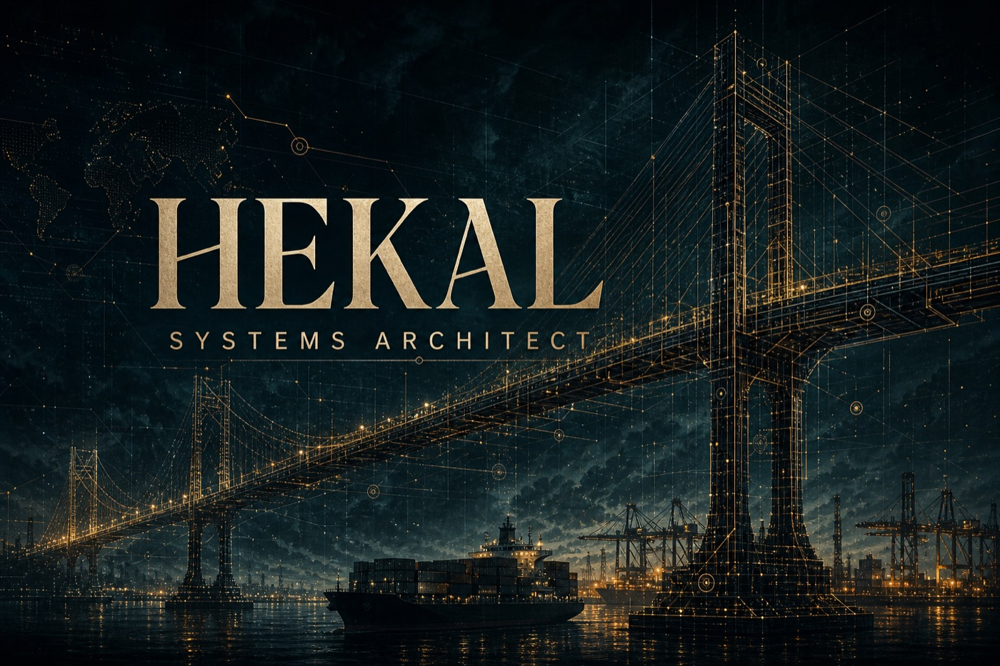
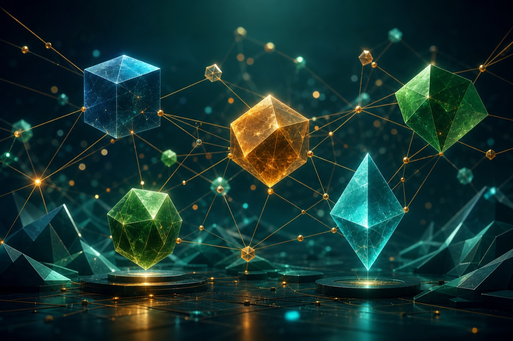
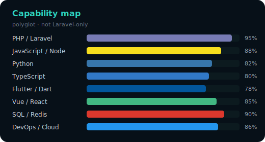
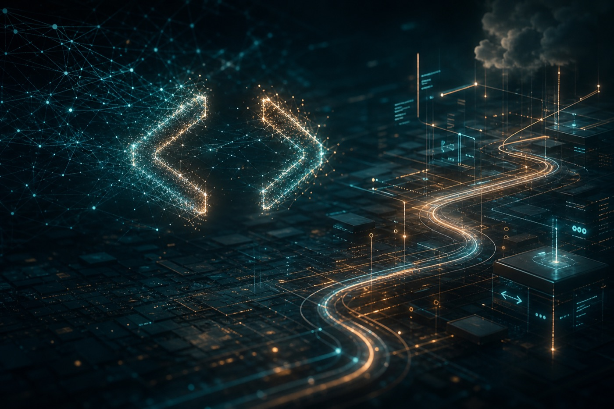
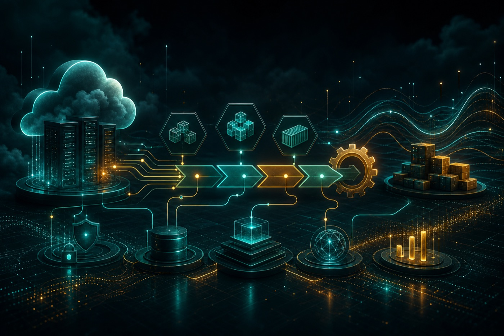
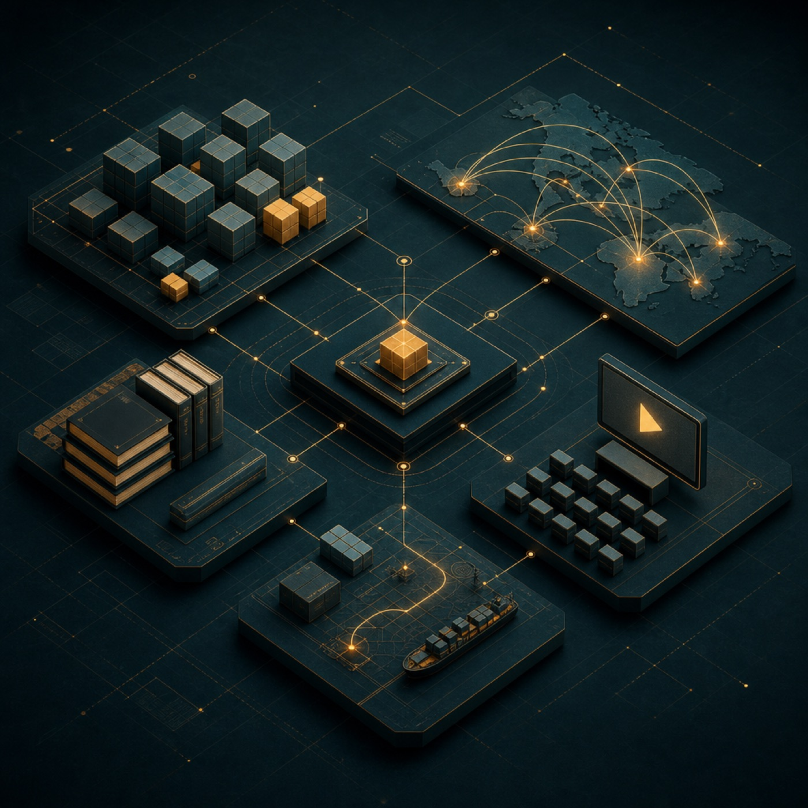
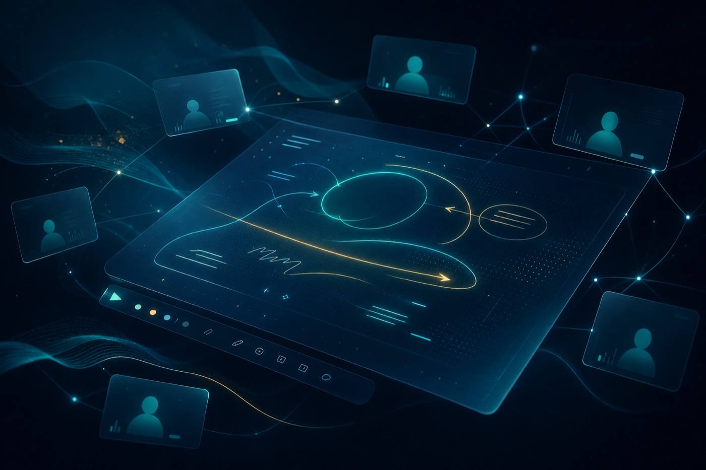
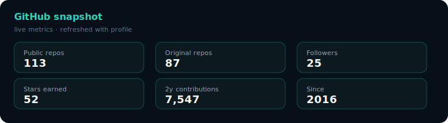
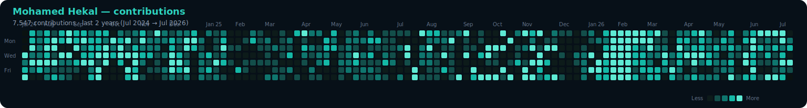

<!--
  Mohamed Hekal — GitHub Profile
  Polyglot Full-Stack · AI-augmented engineering · DevOps · ERP/SaaS
-->

<!-- ===================== HERO ===================== -->

  

<h1 align="center">Mohamed Hekal</h1>

  <b>Senior Full-Stack Engineer · Systems Architect · AI-Augmented Builder</b> 
  <i>Polyglot by craft — Laravel is a strength, not a limit.</i>

  
  &nbsp;
  
  &nbsp;
  
  &nbsp;
  

  
  
  
  

---

## Who I am

I build **production systems** across backend, frontend, mobile, cloud, and AI-assisted workflows.  
Started in tech in **2014**, software & infrastructure by **2016** — ERP/CRM/HMS, SaaS platforms, shipping SDKs, live classrooms, and end-to-end product ownership.

> *I didn’t just learn to build systems — I learned how to rebuild myself.*

**What makes me different**
- **Polyglot delivery** — PHP/Laravel · Node.js · Python · JavaScript/TypeScript · Flutter/Dart · Vue/React  
- **AI as a force multiplier** — faster design, coding, testing, debugging, and deployment loops  
- **DevOps from first principles** — servers, networks, Docker, CI/CD, AWS/Azure — not “someone else deploys it”  
- **Business systems DNA** — inventory, money, tenants, integrations, and operational UIs that survive chaos  

---

## Languages & platforms (not Laravel-only)

  

  
  
  
  
  
  
  
  
  
  
  
  

<table>
<tr>
<td width="55%" valign="top">

| Domain | What I ship with |
|:-------|:-----------------|
| **Backend** | PHP 8.x · Laravel (full-stack ERP/CRM/SaaS) · Node.js · Python · Symfony-ready · OOP · SOLID · Clean Architecture · Modular monolith & microservices patterns |
| **Frontend** | Vue.js · Next.js / React (supporting) · HTML5 · CSS3 · JavaScript · TailwindCSS · Bootstrap · Responsive & accessible UI |
| **Mobile** | Flutter / Dart apps & packages |
| **Data** | MySQL · PostgreSQL · MariaDB · Redis (cache, queues, realtime) · indexing & query optimization |
| **Realtime / EdTech** | TypeScript SDKs · WebRTC / LiveKit · collaborative whiteboards · web components |

</td>
<td width="45%" valign="top" align="center">

Capability map — how I actually work across the stack.

</td>
</tr>
</table>

---

## AI & automation — how I work faster and sharper

  

I treat AI as a **senior pair-programmer + accelerator**, not a gimmick:

| Capability | In practice |
|:-----------|:------------|
| **AI-driven development workflows** | Spec → architecture → implementation loops with agents & copilots |
| **Code generation & refactoring** | Scaffold packages, tests, migrations, docs — then harden by hand |
| **Intelligent problem-solving** | Trace production bugs, design alternatives, threat-model edge cases |
| **AI-assisted testing & QA** | Generate cases, spot regressions, tighten assertions |
| **Performance optimization** | Profile hotspots, propose indexes/queries, validate under load |
| **Smarter deployment** | CI checks, release notes, runbooks, and ops playbooks accelerated by AI |

**Outcome for clients:** shorter delivery cycles, higher code quality, and architecture decisions that stay grounded in production reality.

---

## DevOps & cloud infrastructure

  

I don’t throw code over the wall — I **own the path to production**:

- **Containers & delivery:** Docker · CI/CD (GitHub Actions, GitLab CI) · automated workflows  
- **Cloud:** AWS (EC2, RDS, S3) · Azure · performance tuning  
- **Servers:** Linux administration · Nginx · monitoring · security hardening  
- **Quality in prod:** Sentry · Laravel Telescope · observability mindset  
- **Roots that matter:** network admin + IT systems design → fewer “works on my machine” failures  

---

## Full skills matrix

<b>Backend & frameworks</b>

PHP 8.x · Laravel (full-stack, ERP/CRM/SaaS) · Node.js · Python · Symfony-ready · OOP · SOLID · Clean Architecture · Modular Monolith & Microservices patterns

<b>Frontend & mobile</b>

Vue.js · Next.js / React (supporting) · HTML5 · CSS3 · JavaScript · TypeScript · TailwindCSS · Bootstrap · Responsive & accessible design · Flutter / Dart

<b>Databases & caching</b>

MySQL · PostgreSQL · MariaDB · Redis (caching, queues, realtime analytics) · Database optimization & indexing

<b>Integrations & APIs</b>

REST APIs · Webhooks · Payment gateways (Stripe, PayPal, local banks) · Shipping & logistics APIs · WhatsApp / SMS · Third-party service integrations · Idempotency & resilience patterns

<b>DevOps & cloud</b>

Docker · CI/CD (GitHub Actions, GitLab) · Linux server administration · Nginx · AWS (EC2, RDS, S3) · Azure · Performance tuning · Monitoring & security hardening

<b>Testing & quality</b>

PHPUnit / Pest · Integration & unit testing · Automated workflows · Code review & refactoring · Sentry & Telescope monitoring

<b>AI & automation</b>

AI-driven development workflows · Code generation · Performance optimization · Intelligent problem-solving · AI-assisted testing & deployment

<b>Enterprise IT & infrastructure</b>

Server & network administration · IT systems design · Legacy modernization · Paper-to-digital transformation · Digital operations optimization

<b>Tools & collaboration</b>

Git · Composer · NPM · Postman · Jira · Slack · Agile / Scrum cross-team delivery

---

## Why teams hire me

| You need… | I deliver… |
|:----------|:-----------|
| A backend that stays correct as you scale | Clean architecture, multi-tenancy, audit, feature flags, idempotent APIs |
| ERP / inventory / money that can’t be “almost right” | Locked stock, order state machines, ledger thinking |
| Shipping & third-party chaos under control | Unified carrier SDKs, resilient HTTP, signed webhooks |
| Mobile + web product surface | Flutter apps + Vue/React dashboards on solid APIs |
| Faster delivery without lowering the bar | AI-augmented workflows + DevOps ownership |
| Live education / realtime product | ClassBridge-style sessions, WebRTC, whiteboards, SDKs |

---

## Flagship systems

  

### ShipBridge — unified shipping SDK
One API across many carriers: create · track · label · return · exchange.  
[shipbridge](https://github.com/mohamedhekal/shipbridge) · drivers for Bosta, Aramex, Mylerz, Turbo, J&T, SMSA, FedEx, UPS, DHL, Egypt Post, MNG, HepsiJet, Yurtiçi, Aras, Sürat, PTT

  

### ClassBridge — live classrooms
Laravel core + LiveKit + TypeScript SDK + Yjs whiteboard + Vue UI + web components.  
[classbridge](https://github.com/mohamedhekal/classbridge) · [sdk](https://github.com/mohamedhekal/classbridge-sdk) · [vue](https://github.com/mohamedhekal/classbridge-vue)

  

### Open-source package constellation

| Package | Value |
|:--------|:------|
| [`tenantforge`](https://github.com/mohamedhekal/tenantforge) | Multi-tenant SaaS foundation |
| [`stockpulse`](https://github.com/mohamedhekal/stockpulse) | Concurrent-safe inventory engine |
| [`ledgercore`](https://github.com/mohamedhekal/ledgercore) | Double-entry ledger |
| [`ordermachine`](https://github.com/mohamedhekal/ordermachine) | Order lifecycle state machine |
| [`flagdeck`](https://github.com/mohamedhekal/flagdeck) | Feature flags & tenant targeting |
| [`hookrelay`](https://github.com/mohamedhekal/hookrelay) | Reliable signed webhooks |
| [`integrator`](https://github.com/mohamedhekal/integrator) | Retry · rate-limit · circuit breaker |
| [`oncegate`](https://github.com/mohamedhekal/oncegate) | Idempotency-Key middleware |
| [`guardrail`](https://github.com/mohamedhekal/guardrail) | Roles · abilities · audited impersonation |
| [`testharness`](https://github.com/mohamedhekal/testharness) | Pest / Laravel testing utilities |

Full index → **[oss-portfolio](https://github.com/mohamedhekal/oss-portfolio)**

Also: Flutter packages, Python tools, TypeScript SDKs, and product repos beyond the Laravel ecosystem.

---

## Experience

### Freelance Full-Stack — ERP · CRM · HMS
Enterprise web systems for real operations. **Stack:** PHP/Laravel, Vue, Node where needed, PostgreSQL/MySQL, cloud deploy.

### Full-Stack Engineer — Kzamiza Affiliate Platform *(sole technical owner)*
End-to-end product: admin · vendor · affiliate · APIs · DevOps on **AWS & Azure**.

### Backend Developer — Oracle Media
Scalable backends, REST APIs, high-traffic performance work.

### Foundation — IT Specialist · Network Admin · Solutions Manager
**Neisco** · **Noouh** — infrastructure, networks, cloud, servers, client technical delivery.  
This is why my engineering includes **ops, failure modes, and security**, not only application code.

---

## GitHub pulse — last 2 years

  
  &nbsp;
  

  

  <b>7,547</b> contributions · Jul 2024 → Jul 2026 · heatmap from GitHub GraphQL

---

## Let’s build

  

**Best fit**
- Full-stack / polyglot product builds (web + API + mobile)  
- AI-accelerated delivery for serious backends & SaaS  
- DevOps-ready architecture (Docker, CI/CD, AWS/Azure)  
- ERP · shipping · inventory · multi-tenant platforms  
- EdTech / realtime systems  

  
  
  

  <b>Got a messy business problem?</b> 
  <i>I’ll turn it into architecture — across languages, cloud, and AI-speed delivery.</i>

