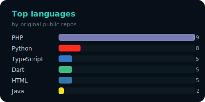

<!--
  Mohamed Hekal — GitHub Profile
  Positioning: Laravel Systems Architect · ERP / SaaS · Shipping · EdTech
-->

<!-- ===================== HERO ===================== -->
<p align="center">
  
</p>

<h1 align="center">Mohamed Hekal</h1>

<p align="center">
  <b>Senior Backend Engineer · Laravel Systems Architect · Full-Stack Builder</b><br/>
  <i>I design production systems that survive scale, concurrency, and real business chaos.</i>
</p>

<p align="center">
  
  &nbsp;
  
  &nbsp;
  
  &nbsp;
  
</p>

<p align="center">
  <a href="https://linkedin.com/in/mohekal"></a>
  <a href="mailto:mohamed.k.hekal@gmail.com"></a>
  <a href="https://wa.me/201101013284"></a>
  <a href="https://github.com/mohamedhekal/oss-portfolio"></a>
</p>

---

<!-- ===================== VALUE PROP ===================== -->
## Why teams hire me

I don’t just “write Laravel.”  
I turn messy business operations — **orders, stock, shipping, money, tenants, classrooms** — into **clean, reusable systems**.

| You need… | I deliver… |
|:----------|:-----------|
| A SaaS that won’t leak data between tenants | Multi-tenancy foundations, roles, feature gates, audit trails |
| ERP / inventory that stays correct under load | Locked stock balances, order state machines, double-entry ledgers |
| Shipping that works across many carriers | One SDK: create · track · label · return · exchange |
| Integrations that don’t die in production | Retries, circuit breakers, idempotency, signed webhooks |
| Live education / realtime product | Classroom core + WebRTC + whiteboard + Vue UI |

> **Positioning:** Senior engineer who ships **installable architecture**, not throwaway demos.

---

<!-- ===================== PROOF STRIP ===================== -->
## Proof at a glance

<p align="center">
  
  
  
  
</p>

<table>
<tr>
<td width="55%" valign="top">

### The story behind the craft

I started working in **2014** while still in high school.  
By **2016** I was deep in software development and IT infrastructure.

Since then I’ve:
- Built **ERP / CRM / HMS** platforms for real businesses  
- Owned products **end-to-end** (product + backend + frontend + DevOps)  
- Led remote delivery and client work across **Egypt, MENA, and international markets**  
- Launched a startup, took hard hits in 2024, and came back sharper  

**Mantra:**  
*I didn’t just learn to build systems — I learned how to rebuild myself.*

</td>
<td width="45%" valign="top" align="center">


<sub>One brain. Many modules. Production-minded.</sub>

</td>
</tr>
</table>

---

<!-- ===================== EXPERTISE ===================== -->
## Core expertise (marketed as outcomes)

### 1. Enterprise Laravel & SaaS architecture
**Hire me when** you need a backend that stays correct as the product grows.

- Multi-tenancy (shared DB, domains, memberships, API keys)  
- Feature flags & tenant targeting  
- Roles, abilities, audited impersonation  
- API versioning, idempotency keys, PII masking  
- Audit trails for compliance-minded products  

**Keywords:** Laravel 11/12 · PHP 8.2+ · SaaS · multi-tenancy · Pest · PHPStan

### 2. ERP, inventory & money flows
**Hire me when** stock, orders, or balances can’t afford “almost right.”

- Inventory reserve / commit / release / transfer with locked balances  
- Order lifecycle state machines  
- Double-entry ledger thinking for ERP / fintech  
- Affiliate, vendor, and admin operational panels  

**Keywords:** ERP · WMS · inventory · accounting · PostgreSQL / MySQL · Redis

### 3. Shipping & third-party integrations
**Hire me when** carriers, payment gateways, or webhooks keep breaking your ops.

- Unified shipping SDK across Egypt / MENA / Turkey / global carriers  
- Resilient HTTP clients (retry, rate-limit, circuit breaker)  
- Outbound webhooks + HMAC inbound ingest  
- WhatsApp / SMS / banking / payment gateway integrations  

**Keywords:** logistics · carriers · webhooks · idempotency · AWS / Azure

### 4. Full-stack product ownership
**Hire me when** you need one senior who can own the whole surface.

- Laravel + Vue.js dashboards and operational UIs  
- TypeScript SDKs & web components  
- Docker, CI/CD, cloud deployment hygiene  
- From IT networking roots → cloud production systems  

**Keywords:** Vue 3 · TypeScript · DevOps · Docker · AWS

---

<!-- ===================== FEATURED PRODUCTS ===================== -->
## Flagship open-source systems

These are not tutorial repos. They are **libraries meant to be installed**.

### ShipBridge — one shipping API for many carriers

<p align="center">
  <a href="https://github.com/mohamedhekal/shipbridge">
    
  </a>
</p>

**Problem:** every carrier has a different API, status language, and label flow.  
**Solution:** one Laravel abstraction for create · track · label · return · exchange.

<p>
  <a href="https://github.com/mohamedhekal/shipbridge"></a>
  <a href="https://packagist.org/packages/mohamedhekal/shipbridge"></a>
</p>

**Carriers covered:** Bosta · Aramex · Mylerz · Turbo · J&T · SMSA · FedEx · UPS · DHL · Egypt Post · MNG · HepsiJet · Yurtiçi · Aras · Sürat · PTT

```php
$shipment = ShipBridge::driver('bosta')->createShipment($request);
$label    = ShipBridge::driver('bosta')->label($shipment->id);
$track    = ShipBridge::driver('bosta')->track($shipment->trackingNumber);
```

---

### ClassBridge — embeddable live classrooms

<p align="center">
  <a href="https://github.com/mohamedhekal/classbridge">
    
  </a>
</p>

**Problem:** education products need realtime video + collaboration without rebuilding WebRTC from scratch.  
**Solution:** Laravel classroom core + LiveKit provider + TypeScript SDK + Yjs whiteboard + Vue UI + web component.

<p>
  <a href="https://github.com/mohamedhekal/classbridge"></a>
  <a href="https://github.com/mohamedhekal/classbridge-sdk"></a>
  <a href="https://github.com/mohamedhekal/classbridge-vue"></a>
</p>

---

### Laravel package ecosystem

| Package | Business value |
|:--------|:---------------|
| [`tenantforge`](https://github.com/mohamedhekal/tenantforge) | Launch multi-tenant SaaS without reinventing isolation |
| [`stockpulse`](https://github.com/mohamedhekal/stockpulse) | Keep inventory truthful under concurrent orders |
| [`ledgercore`](https://github.com/mohamedhekal/ledgercore) | Double-entry money movement for ERP / fintech |
| [`ordermachine`](https://github.com/mohamedhekal/ordermachine) | Explicit order lifecycle — no mystery statuses |
| [`flagdeck`](https://github.com/mohamedhekal/flagdeck) | Roll features safely per tenant / user / % |
| [`hookrelay`](https://github.com/mohamedhekal/hookrelay) | Reliable outbound + signed inbound webhooks |
| [`integrator`](https://github.com/mohamedhekal/integrator) | HTTP that retries, rate-limits, and fails gracefully |
| [`oncegate`](https://github.com/mohamedhekal/oncegate) | Stripe-style Idempotency-Key protection |
| [`guardrail`](https://github.com/mohamedhekal/guardrail) | Roles, abilities, audited support impersonation |
| [`testharness`](https://github.com/mohamedhekal/testharness) | Faster, stricter Laravel / Pest testing |

Full catalog → **[oss-portfolio](https://github.com/mohamedhekal/oss-portfolio)**

---

<!-- ===================== EXPERIENCE ===================== -->
## Professional experience

### Freelance Full-Stack Developer — ERP · CRM · HMS
**What I sold:** custom enterprise web systems for clients who needed operations software, not marketing sites.  
**Stack:** PHP, Laravel, Vue.js, PostgreSQL  
**Impact:** scalable, secure, maintainable platforms tailored to real workflows (inventory, clients, healthcare ops).

### Full-Stack Engineer (Remote) — Kzamiza Affiliate Platform
**What I owned:** the entire product as sole technical owner.  
**Built:** admin dashboards, vendor panels, affiliate modules, backend APIs, DevOps on **AWS & Azure**.  
**Impact:** one engineer shipping a full commercial affiliate platform end-to-end.

### Backend Developer (Remote) — Oracle Media
**Focus:** scalable backend architectures, REST APIs, performance for high-traffic platforms.

### Foundation — IT Specialist · Network Admin · Solutions Manager
**Neisco** · **Noouh**  
Infrastructure, networking, monitoring, cloud deployments, server setups, and API-integrated client solutions.  
This is why my software thinking includes **failure modes, networks, and operations** — not only controllers and migrations.

---

## Tech stack

<p align="center">
  
  
  
  
  
  
  
  
  
  
  
  
</p>

**Also in the toolkit:** Django · Solidity / Web3 · Networking & cybersecurity fundamentals · WhatsApp / SMS APIs · payment gateways.

---

## GitHub pulse — last 2 years

<p align="center">
  
  &nbsp;
  
</p>

<p align="center">
  
</p>

<p align="center">
  <sub>Heatmap generated from GitHub GraphQL · <b>7,547</b> contributions · Jul 2024 → Jul 2026</sub>
</p>

---

## Let’s work together

<p align="center">
  
</p>

**Best fit projects**
- Laravel SaaS / ERP architecture & package design  
- Shipping / logistics integrations (especially MENA)  
- Inventory, orders, ledgers, webhook reliability  
- EdTech / realtime classroom products  
- Mentorship or technical partnership on serious builds  

<p align="center">
  <a href="https://wa.me/201101013284"></a>
  <a href="mailto:mohamed.k.hekal@gmail.com"></a>
  <a href="https://linkedin.com/in/mohekal"></a>
</p>

<p align="center">
  <b>Got a messy business problem?</b><br/>
  <i>I’ll turn it into architecture you can ship.</i>
</p>
